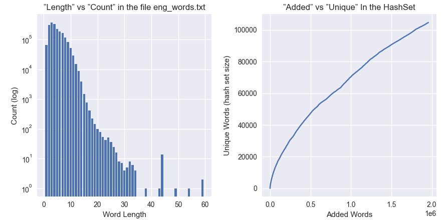
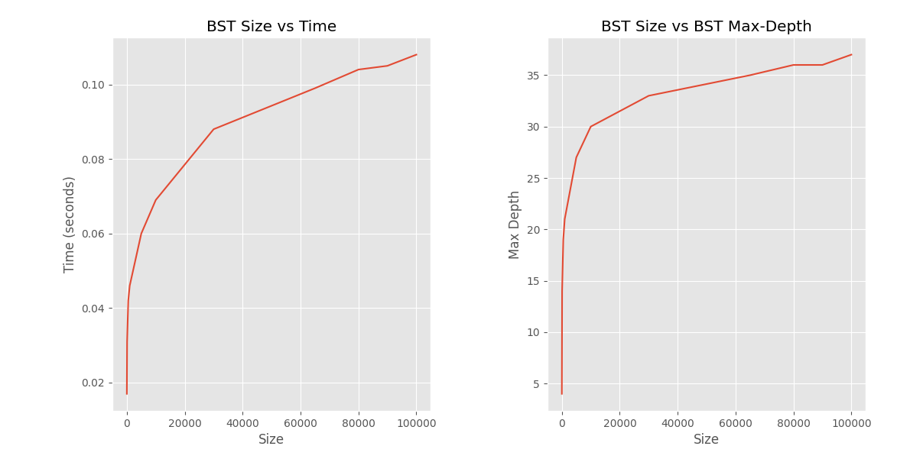
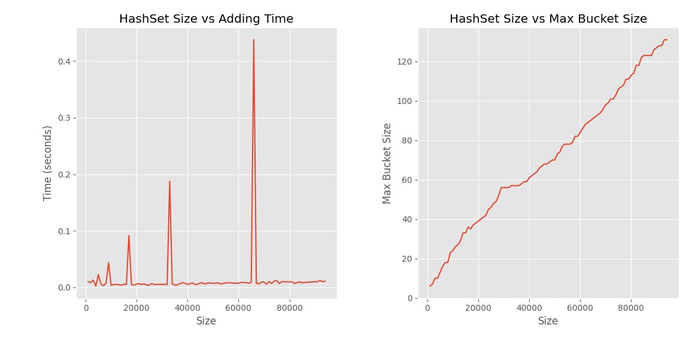

# Mini-project report 
Members: Kenan Maslan, Nour Mazoukh, Sam Najafi Zadeh, Albin Lundström

Program: Software Technology  

Course: 1DV501
Date of submission: 2021-10-24

## Introduction  


## Part 1: Count unique words 1
- ``eng_news_100K-sentences`` has ``1950241`` words in total, and it has ``87682`` unique words.
- ``holy_grail`` has ``11258`` words in total, and it has ``1957`` unique words.
- We counted the unique words by adding keys to them. This is the code that counts occurances:
```python
def count_occurrences(lst):
    dct = {}
    for i in lst:
        if i not in dct.keys():  # If item is not a key add it
            dct[i] = 0
        dct[i] += 1
    return dct
```
- Here is the result of both files (``holy_grail.txt`` first):
* The 10 most freq. occurring words with a length larger than 4:

1:
```python
_________________________________
(1)     257             - arthur 
(2)     102             - launcelot 
(3)     82              - knight
(4)     81              - galahad
(5)     76              - father
(6)     68              - bedevere
(7)     65              - knights
(8)     58              - guard
(9)     58              - robin
(10)    57              - right
```
2:
```python
_________________________________
 Rank   Occur           Word
_________________________________
(1)     6121            - their
(2)     4579            - about
(3)     3863            - would
(4)     3632            - people
(5)     3601            - there
(6)     3565            - which
(7)     2964            - after
(8)     2860            - first
(9)     2732            - years
(10)    2717            - other
```
## Part 2: Implementing data structures
- The task is to build and use a Hash-based set and a Binary search tree based map. The hash-based set will be built by using a Python list to store buckets where each bucket is another Python list. The initial size of the list should be 8 and when the number of buckets equals the number of elements it should double itself(rehashing). For the BST based map each node will have four fields (key, value, left-child and right-child).

- For the hash-based word set we compute the hash value by assigning each character in a word to an ASCII-value then adding all the values and assigning that word to a bucket by taking modulus the amount of elements in the list. Following code:
```python
def get_hash(self, word):
        hash = 0
        for i in range(len(word)):
            hash += i * ord(word[i])
        # for c in word:
        #     hash += ord(c)
        return hash % self.bucket_list_size()
```
- The function add assigns a word to a bucket by first getting it's hash-value and then checking if the word is not already added. If the word is not already added it adds the word to the bucket and incrementing the number of buckets by 1. If there is as many buckets as elements in list it rehashes. Following code:
```python
def add(self, word):
        hash = self.get_hash(word)
        if word not in self.buckets[hash]:
            self.buckets[hash].append(word)
            self.size += 1
            if self.size == self.bucket_list_size():
                self.rehash()
```
- The function rehash creates a new list that is double the size of the previous one. (For example the first one is 8 elements big then the next one will be 16 elements then 32 and so on.) It works through the elements of the previous buckets, then adds the words to the new one and sets it's size value to 0. Following code:
```python
def rehash(self):
        words = []
        for bucket in self.buckets:
            for element in bucket:
                words.append(element)
        new_size = self.size * 2
        self.buckets = [[] for i in range(new_size)]
        self.size = 0
        for word in words:
            self.add(word)     
```
- Differences between the original output and our output: Max bucket size increased from 2 to 3.


- The BST based map function put asserts keys so that the left subtree of a node only contains nodes with keys lesser than the node's key and so that the right subtree of a node contains only nodes with keys greater than the node's key.
Following code:
```python
def put(self, key, value):
        if self.key == key:
            self.value = value
        elif self.key > key:
            if self.left is not None:
                self.left.put(key, value)
            else:
                self.left = Node(key, value, None, None)
        elif self.key < key:
            if self.right is not None:
                self.right.put(key, value)
            else:
                self.right = Node(key, value, None, None)
```
- The function for max depth checks how far "down" the tree goes. First the value is set to 0 then it goes further down the tree in both directions until it hits None. The output value printed is the node furthest down.
```python
def max_depth(self):
        left, right = 0, 0
        if self.left is not None:
            left = self.left.max_depth()
        if self.right is not None:
            right = self.right.max_depth()
        if left > right:
            return left + 1
        else:
            return right + 1
```
* There are no differences in results from original output, exactly the same.
## Part 3: Count unique words 2
- How did you implement the Top-10 part of the problem. Feel free to show code fragments.
* Our Top-10 implementation sorts the list and then gets the top-10 tuples.
```python
top_ten = sorted(occur, key=lambda x: x[1], reverse=True)[0:10]

    print('_'*33 + '\n Rank\tOccur\t\tWord\t\n' + '_'*33)

    j = 0  # j is the rank of the word
    for i in top_ten:  # loop top ten list
        print(f'({j+1})\t{i[1]}\t\t- {i[0]} ')
        j += 1
```
- Present a unique word count and the Top-10 lists for each of the two files.

 ```python
_________________________________
(1)     257             - arthur 
(2)     102             - launcelot 
(3)     82              - knight
(4)     81              - galahad
(5)     76              - father
(6)     68              - bedevere
(7)     65              - knights
(8)     58              - guard
(9)     58              - robin
(10)    57              - right
```

```python
_________________________________
 Rank   Occur           Word
_________________________________
(1)     6121            - their
(2)     4579            - about
(3)     3863            - would
(4)     3632            - people
(5)     3601            - there
(6)     3565            - which
(7)     2964            - after
(8)     2860            - first
(9)     2732            - years
(10)    2717            - other
```
* What is the max bucket size for HashSet, and the max depth for BstMap, after having added all the words in the two large word files? (Hence, four different numbers.)

 ```python
- Result for the file holy_words.txt
* The number of different words in the file:1967
- Max bucket size for HashSet: 16
- Max depth for BstMap:  22
```
```python
- Result for the file eng_words.txt
* The number of different words in the file:104717
- Max bucket size for HashSet: 129
- Max depth for BstMap:  52
```

## Part 4: Plotting
We start by reading the words from the text file contaning all the words in the file eng_news_100K-sentences.txt.
Using the function ```read_file(file_path)```, this function takes a file path, adds all the words to a new list, and returns the result.
* To count how many words of a given length we start by making a new instance of our binary search tree.
First of all we iterate over our word list that we read from the file, for-each word we get its length (as a key) and try getting it from the BST, if the length (key) does exist we simply add one to its value; which in this case is the count of words with the same length, if the key doesn't exist we add new key with the value '1'.
```python
    .
    for i in lst:
        word_length = len(i)
        word_count = bmap.get(word_length)
        if word_count is not None: 
            bmap.put(word_length, word_count+1)
        else: 
            bmap.put(word_length, 1)
    .
        
```
In the end of this function we convert and return the BST as a list. This list will contain out data (length, count).

* In another function using our implementation of hash set we add all the words from our file to a new instance of hashset, everytime we try to add a new item we save the size of the hash set to a new list which will going to be the data for the 2nd plot.
```python 
...
for i in lst:
        hash_set.add(i)
        added_words.append(hash_set.get_size())
```
### Plot:


**Words vs Count**
The plot on the left compares the length of the words to the count logaritmic scale because of the big difference between the shortest word the the longest.

**Added vs Unique** The next plot represent the number or the words we tried to add to out hash set vs the size of out hashset which is the unique words.


## Part 5: Measuring time
The goal in this assignment was to measure the look-up time in a binary search tree, and to measure the time it take to add items to a hashset. I separated the requirments into two python scripts:

## Part 5.1. Measure the look-up time
* First of all I modified the read_file function to be able to read all the words in a file of specific number of words, we need this functionalty in out testing environment because the requirment is to measure the look-up time for a fix number of keys in trees of **different sizes**. 
The read_file function is the same as the original func that we used in other part of the project the only difference is that the function can take a argument other that the file path, which is a int(word_count), the arg is optional and defaults to None, if it's not null we run the following code.
```python
for line in txt_file:
            lst.extend(line.replace('\n', '').split('\n'))
            max_words -= 1
            if max_words <= 0:
                break
```
Another subtask is that we need to convert number of lists to bstmap. we do not care about the values so we keep all the values to ``` None```
```python
def to_bst(lst):
    bmap = bst.BstMap()
    for i in lst:
        bmap.put(i, None)
    return bmap
```
* ```random_keys(path)``` This function gets random 20000 words from our list of unique. the keyword *random* is important, because taking the first 20k words will not give us accurate result.
### The actual measurement
Because we need to measure multiple bst multiple time, we created a helper function the takes list of keys and a bst map and times how long it takes to search the bst map 5 times.
```python
def time_lookup(keys, bst_map):
    start = time.time()
    for i in range(5):
        for key in keys:
            bst_map.get(key)
    elapsed = time.time() - start
    return round(elapsed/5, 3)
```
In short, ```time_lookup``` Gets the mean time needed to search ```keys``` in ```bst_map```.
```measure_lookup()``` is the task that combines all the task to returns the data:
1. We gets a list of random keys from ```random_keys(path)``` 
2. We create 3 lists one for 'max_depth', 'look-up time' and last one for the different 'sizes' of BST; The sizes are hard coded to best represent the look-up time vs size, I chose the following:

```python
sizes = [10, 100, 500, 1000, 5000, 10000, 30000, 65000, 80000, 90000, 100000]
```
3. The main loop:

    3.1 We loop over all the sizes

    3.2 Read (number) of words from our text file.

    3.3 Convert the list to BST map.

    3.4 We fed the key and test bstmap to ```time_lookup``` then save the time to the 'look-up time'

    3.5 Append the max_depth of the test object to 'max_depth' list
4. After looping over all the sizes we end up with 3 lists; sizes, times and depths which are our date
### Plot


**BST Size vs Time** : We can clearly see that the time  increases proportional with the size of the BSTmap.
**BST Size vs Max-depth** The depth increases rapidly in the first 20k the becomes more linear for bigger sizes.

## Part 5.2. Measure adding to hashset:
Creating test enviorment to measure how long it takes to add an item to a hashset is simple, we start by using the same ```read_file``` function to read our list of unique words. Almost all the logic happens inside a function called ```measure_hset```
We start by creating 3 empty lists, sizes, times and max_bucket. Then create new hashset.
```python 
    i = 0 # We use it to stop the timer when it reachs 1k
    start = time.time() # We start the timer!
    for word in words: # We loop over our unique words
        if i == 1000:
            .
            . # Explained next
            .
        hash_set.add(word) # We add the word to hashset
        i += 1 # Increased we we add new element
    return sizes, max_bucket, times
```
When we added 10k words we do the following
```python 
    elapsed = time.time() - start # Stop the timer
    # save the max bucket, the size and the elapsed time  
    # for the last 1k items
    max_bucket.append(hash_set.max_bucket_size()) 
    sizes.append(hash_set.get_size()) 
    times.append(elapsed)
    # Reset the timer and the int
    i = 0 
    start = time.time()
```
This would be it for the measurment but we can make the results more accurate by running ```measure_hset``` multiple times, we do that with the following:
```python
    sizes, max_bucket, avg_time = measure_hset(words)
    for i in range(3):
        _, _, time = measure_hset(words)
        for j in range(len(avg_time)):
            avg_time[j] = avg_time[j] + time[j] / 2
```
### Plot


**HashSet Size vs Time** : The result is as we expect; Adding items to a hashset is linear, we get spikes for each time we rehash the set, and the spikes will take longer to occure and increase when the size of the hashset gets bigger.

**HashSet Size vs Max Bucket Size** : The graph is linear, because the more item we add the more the error result of out hashing method will amplifi and gets more noticeable.

## Project conclusions and lessons learned
We separate technical issues from project related issues.
### Technical issues 
- The major technical challenges was to figure out how to build the hash set and BST map.
- Key lessons is always having some main structure for your division of labor and to always start in time.
- More detailed report and more detailed comments for the code.

### Project issues
- We made the first contact through mymoodle and later we established a Slack channel for ease of communication. Chats about the project happened daily. We stumbled across some problems in the project due to Albin being sick the first week and Sam joining one week in to the project. 
- For each individual team member: 
 	* We all had some hand in every task except the VG-ones which Nour is completely responsible for. The main contributors for Part 1 is Nour and Kenan. For the BST map Kenan was the main-contributor with Sam as co-contributor. The hash set was mainly created by Nour and for Part 3 Sam was the main-contributor with Albin as co-contributor. The report have Albin as main-contributor with everyone contributing in some way. As stated above everyone have had their hands in all the parts of the project.
 	* Estimate hours spend each week (on average): 20hrs. approx 5h each.
 - Lessons learned is that it's always easier working together face-to-face rather than communicating via the web. 


